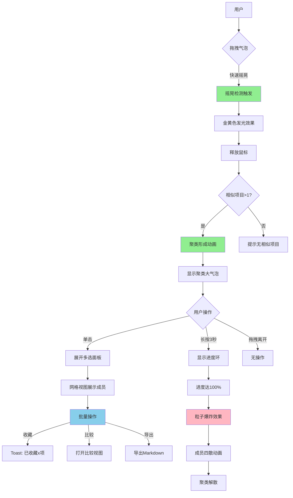

# RepoGalaxy UI/UX 设计文档

> 状态：规划中 | 最后更新：2026-03-13
> 设计语言：**Fluent Design 2** + **数据可视化**

---

## 1. 设计愿景

**核心理念**：在沉浸式的星空背景中，通过**数据可视化**高效发现代码宝藏。

**参考标杆**：
- Windows 11 Microsoft Store 的秩序感
- Apple Watch App Library 的圆形网格
- 科学可视化的多维数据编码

**设计关键词**：
- 🌌 沉浸、深邃、流动
- 📊 数据、可视化、洞察
- ✨ 星光、脉动、发现
- 🐱 友好、有温度

---

## 2. 全局背景系统

### 2.1 星空动态背景 (全应用统一)

```
层级结构:

┌─────────────────────────────────────────────────────────────────────┐
│  Layer 0: 星空动态背景 (全局)                                        │
│  ─────────────────────────────────────────────────────────────────  │
│  • 深色底色 (#0D1117)                                               │
│  • 50-100 个星光粒子缓慢漂移 (20-40秒周期)                           │
│  • 中央 Octocat 轮廓 (星光连线勾勒)                                  │
│  • 鼠标视差效果 (±20px, 平滑跟随)                                    │
├─────────────────────────────────────────────────────────────────────┤
│  Layer 1: 内容区                                                    │
│  ─────────────────────────────────────────────────────────────────  │
│  • 圆形仓库气泡云 (透出星空背景)                                     │
│  • 半透明效果 (亮度/颜色保留)                                        │
└─────────────────────────────────────────────────────────────────────┘
```

### 2.2 背景性能

- 帧率目标：60fps
- CPU 占用：< 5%
- 窗口失焦自动暂停
- 设置中可关闭动画

---

## 3. 窗口规格

- 默认：1280x800 非全屏中小窗
- 最小：900x600
- 背景：星空动态

---

## 4. 标题栏

```
┌─────────────────────────────────────────────────────────────────────┐
│ [Logo] RepoGalaxy  v0.1.0 [DEV]           [🔔] [─] [□] [×]          │
│  透明/Acrylic，与星空融合                                            │
└─────────────────────────────────────────────────────────────────────┘
```

---

## 5. 左侧导航栏 (Microsoft Store 风格)

```
┌─────────────────────────────┐
│                             │
│  ┌───────────────────────┐  │
│  │        🌌             │  │  ← 默认选中
│  │       主页            │  │     主页 = 探索
│  │     (可视化)          │  │
│  └───────────────────────┘  │
│                             │
│  ┌───────────────────────┐  │
│  │        ⭐             │  │  ← 收藏
│  │       收藏            │  │
│  └───────────────────────┘  │
│                             │
│  ┌───────────────────────┐  │
│  │        📦             │  │  ← GitHub 仓库
│  │       仓库            │  │
│  └───────────────────────┘  │
│                             │
│  ┌───────────────────────┐  │
│  │        💻             │  │  ← 本地仓库
│  │       本地            │  │
│  └───────────────────────┘  │
│                             │
│  ─────────────────────────  │
│                             │
│  ┌───────────────────────┐  │
│  │        ⚙️             │  │  ← 设置
│  │       设置            │  │
│  └───────────────────────┘  │
│                             │
└─────────────────────────────┘
  72px 固定宽度
```

**导航项样式**：
- 图标在上，文字在下
- 选中：圆角背景 + Accent 色
- 未选中：透明 + Hover 效果

---

## 6. 主页/探索页面 (核心创新)

### 6.1 页面布局

```
┌─────────────────────────────────────────────────────────────────────┐
│ [TitleBar with Acrylic]                                             │
├────────┬────────────────────────────────────────────────────────────┤
│        │                                                    🌌     │
│  🌌    │                                            (星空背景透出) │
│  主页  │                                                            │
│        │  ┌──────────┬──────────┐                                   │
│  ⭐    │  │ 本周     │ 最活跃   │  ← 二元筛选 Pill 栏              │
│  收藏  │  └──────────┴──────────┘                                   │
│        │                                                            │
│  📦    │  ╭─────────────────────────────────────────────────────╮  │
│  仓库  │  │                                                     │  │
│        │  │     ●━━━●━━━●●                                      │  │
│  💻    │  │    ━●━━━●━━━●━━━●━━●        圆形仓库气泡云          │  │
│  本地  │  │     ━━━●━━━●━━━●●                                 │  │
│        │  │    ━━●━━━●━━━━●━━━●●●                            │  │
│  ⚙️    │  │      ━━━━●━━━●━━━━●━━●                           │  │
│  设置  │  │     ━━━●━━━━●━━━●━━━●                              │  │
│        │  │                                                     │  │
│        │  │  (从上往下：新→旧，从左往右：Star多→少)            │  │
│        │  │                                                     │  │
│        │  ╰─────────────────────────────────────────────────────╯  │
│        │                                                            │
└────────┴────────────────────────────────────────────────────────────┘
```

### 6.2 可视化映射系统 (7维编码)

```
每个圆形同时编码 7 个维度：

┌─────────────────┬────────────────────────────────────┐
│ 视觉通道         │ 数据维度                            │
├─────────────────┼────────────────────────────────────┤
│ 垂直位置 (Y)     │ 时间 (新→旧)  ↑越往上越新           │
│ 水平位置 (X)     │ Star 数量 (多→少) ←越往左越多星     │
│ 半径大小         │ Star 数量 (非线性: 0-100-200-500-1k-10k)│
│ 内部扇形         │ 编程语言比例 (饼图)                  │
│ 亮度             │ 最后提交时间 (新→亮, 旧→暗 40%-100%)│
│ 闪烁频率         │ 综合活跃度 (0-2Hz, Star增速+Issue活动)│
│ 呼吸缩放         │ Fork 数量 (幅度 0-0.15, 周期2-4s)   │
└─────────────────┴────────────────────────────────────┘

Apple Watch App Library 风格布局:
• 圆形网格排列，非列表
• 紧密排列，像气泡一样
• 大小不同的圆形自然分布
• 从上往下：时间维度 (新→旧)
• 从左往右：热度维度 (多→少)
```

### 6.3 圆形仓库图标详解

```
┌─────────────────────────────────────────────────────────────────────┐
│                                                                     │
│  单个圆形结构：                                                      │
│                                                                     │
│        ╭────────────╮                                              │
│       ╱  🔵🔵🔵🟢   ╲         🔵 Rust (60%)                       │
│      │  🔵🔵🟢⚪⚪   │        🟢 Python (30%)                    │
│       ╲  🟢⚪⚪⚪⚪   ╱         ⚪ Other (10%)                      │
│        ╰────────────╯                                              │
│                                                                     │
│  视觉特性：                                                          │
│  • 大小：24-72px (根据 Star 数)                                     │
│  • 亮度：40-100% (根据新旧程度)                                     │
│  • 闪烁：0-2Hz (根据活跃度)                                         │
│  • 呼吸：轻微缩放 (根据影响力)                                      │
│                                                                     │
│  Hover 时：                                                          │
│  • 放大 1.1x                                                        │
│  • 显示 Tooltip (名称/作者/Star/语言)                               │
│  • 其他圆形变暗 (聚焦)                                              │
│                                                                     │
└─────────────────────────────────────────────────────────────────────┘
```

### 6.4 二元筛选 Pill 栏

```
┌─────────────────────────────────────────────────────────────────────┐
│                                                                     │
│  可定制的二元筛选：                                                  │
│                                                                     │
│  ┌─────────────┬─────────────┐                                     │
│  │ 时间范围 ▼  │ 排序方式 ▼  │                                     │
│  └─────────────┴─────────────┘                                     │
│                                                                     │
│  维度 A (时间)：                                                     │
│  • 全部时间  • 今天  • 本周  • 本月  • 今年                         │
│                                                                     │
│  维度 B (排序)：                                                     │
│  • 智能推荐  • Star最多  • 最新提交  • 最活跃  • 正在趋势           │
│                                                                     │
│  组合示例：                                                          │
│  ┌──────────┬──────────┐  → 本周最活跃的项目                       │
│  │ 本周     │ 最活跃   │                                         │
│  └──────────┴──────────┘                                          │
│                                                                     │
└─────────────────────────────────────────────────────────────────────┘
```

### 6.5 加载与空状态

```
加载中:
• 骨架屏：灰色圆形占位
• 文字："正在扫描宇宙..."
• 动画：圆形逐个出现 (stagger)

空状态:
• 图标：🌌 空星球
• 文字："这片星空很安静"
• 按钮：[换个筛选条件] [刷新]
```

---

## 7. 其他页面

### 7.1 收藏页面

```
类似主页的可视化，但只显示收藏的项目
增加：收藏夹分组 (可横向滑动切换)
```

### 7.2 仓库页面 (个人 GitHub)

```
列表视图 (更实用)：
- 自己的仓库按更新时间排序
- 显示 Stars/Forks/Issues 统计
- 快速跳转到 GitHub
```

### 7.3 本地页面

详见 [GIT_INTEGRATION.md](./GIT_INTEGRATION.md)

```
本地仓库管理：
- 扫描本地 Git 仓库
- 显示 Git 状态 (分支/未提交/ahead/behind)
- 快捷打开 (VS Code/终端)
- 轻量操作 (Pull/Fetch)
```

### 7.4 设置页面

```
Windows 11 设置风格：
- 左侧分类导航
- 右侧卡片式设置项
- 背景透出星空
```

---

## 8. 材质与效果

### 8.1 材质层级

```
Layer 0: 星空背景 (动态)
Layer 1: 导航栏 Acrylic (60%)
Layer 2: 圆形仓库 (透明中心，透出星空)
Layer 3: Tooltip/弹窗 Acrylic (80%)
```

### 8.2 圆角规范

| 元素 | 圆角 |
|------|------|
| 窗口 | 8px |
| 导航项 | 8px |
| 圆形仓库 | 50% (正圆) |
| Pill 标签 | 16px |
| Tooltip | 8px |
| 设置卡片 | 8px |

---

## 9. 动画系统

### 9.1 背景动画

- 星光粒子：缓慢漂移 + 闪烁
- Octocat：呼吸效果
- 鼠标视差：平滑跟随

### 9.2 圆形动画

```
入场：
• 从中心向外扩散
• Stagger 延迟 (根据位置)
• EaseOutBack 缓动
• 时长：400-600ms

闪烁：
• 频率映射到活跃度
• 使用共享动画时间轴

呼吸：
• 幅度映射到 Fork 数
• 2-3秒周期

Hover：
• 放大 1.1x (200ms)
• 其他圆形变暗
```

### 9.3 交互动画

```
点击：
• 按下：缩小到 0.9x (50ms)
• 释放：弹性回到 1.0x (200ms)

页面切换：
• 圆形淡出/淡入
• 背景保持不变

筛选切换：
• 圆形重新排列 (400ms)
• 使用 FLIP 动画技术
```

---

## 10. 交互方式

### 10.1 鼠标操作

```
左键单击：
• 打开仓库详情面板 (右侧滑入)

左键拖拽：
• 平移视图 (浏览更多)

滚轮：
• 垂直滚动 (时间维度)

Shift+滚轮：
• 水平滚动 (Star 维度)

Ctrl+滚轮：
• 缩放视图 (看更多/更少项目)

双击：
• 重置视图到默认位置
```

### 10.2 触控板操作

```
双指滑动：
• 平移视图

双指捏合：
• 缩放视图
```

### 10.3 悬停效果

```
Hover 圆形：
• 气泡停止漂浮运动
• 放大 1.1x (200ms, EaseOut)
• 显示 Tooltip
• 其他圆形变暗 30%

Tooltip 内容：
┌─────────────────────────────┐
│ 📛 repo-name                │
│ 👤 owner                    │
│ ⭐ 1.2k  🍴 234  👁️ 56      │
│ 🏷️ rust • cli               │
│ 🕐 更新于 2小时前            │
└─────────────────────────────┘

鼠标离开：
• 缩小恢复 1.0x
• 恢复漂浮运动
• 隐藏 Tooltip
• 其他气泡恢复亮度
```

### 10.4 拖拽与摇晃聚类 (创新交互)

```
拖拽气泡：
• 左键按下 → 气泡跟随鼠标
• 放大 1.1x
• 其他气泡变暗

摇晃检测：
• 快速左右移动鼠标 (>3次/秒)
• 气泡发光 + 颜色偏移 (Accent色)
• 显示"摇晃中..."提示
• 触发相似项目检索

松开鼠标：
• 同类小气泡被吸引 (飞入动画 500ms)
• 融合成大气泡 (1.5-2.5x, 弹性动画)
• 显示 "+N" 计数
• 进入聚类状态

点击大气泡：
• 展开多选预览面板
• 网格显示子项目
• 支持勾选/全选
• 批量操作按钮 (Star/收藏)
```

### 10.5 长按破裂 (创新交互)

```
长按大气泡 (3秒)：
• 0.0s: 开始倒计时，边框黄色
• 1.0s: 边框橙色，轻微抖动
• 2.0s: 边框深橙色，中等抖动
• 3.0s: 红色 → 破裂!

破裂动画：
• 粒子效果: 10-20 个碎片飞溅
• 小气泡四散弹射 (随机方向)
• 每个小气泡恢复独立漂浮
• 大气泡缩小消失 (800ms)

效果：解散聚类，恢复各自独立状态
```

### 10.6 手势总结

| 操作 | 效果 | 场景 |
|------|------|------|
| 单击 | 打开详情卡 | 浏览 |
| 双击 | 重置视图 | 导航 |
| 拖拽 | 平移视图/拖拽气泡 | 探索 |
| 拖拽+摇晃 | 触发聚类 | 发现相似项目 |
| 长按3s | 破裂聚类 | 解散分组 |
| 滚轮 | 垂直滚动 (时间轴) | 浏览历史 |
| Shift+滚轮 | 水平滚动 (Star轴) | 浏览热度 |
| Ctrl+滚轮 | 缩放视图 | 概览/细节 |

---

## 11. 性能优化

### 11.1 渲染优化

```
虚拟化：
• 只渲染视口内圆形
• 视口外 200px 预渲染
• 对象池复用节点

Canvas 绘制：
• 大量圆形时使用 SkiaSharp
• GPU 加速

LOD：
• 缩小时简化细节
• 放大时显示完整信息
```

### 11.2 数据优化

```
分页加载：
• 首次加载 50-100 个
• 滚动到底部加载更多
• 使用 Intersection Observer

缓存：
• GitHub API 响应缓存
• 本地 IndexedDB/SQLite
```

---

## 12. 待确认问题

| 问题 | 选项 | 备注 |
|------|------|------|
| 闪烁映射 | A) Issue活跃度 B) Star增速 C) 综合 | 影响 API 调用量 |
| 呼吸映射 | A) Fork数 B) 用户相关度 C) 固定 | 影响用户体验 |
| 默认筛选 | 时间+排序组合 | 影响首次印象 |
| 圆形数量 | 50/100/无限 | 影响性能 |
| 颜色盲支持 | 形状+颜色双重编码 | 无障碍 |
| 性能模式 | 关闭动画选项 | 低端设备 |

---

## 13. 文档索引

| 文档 | 内容 |
|------|------|
| [VISUALIZATION_SYSTEM.md](./VISUALIZATION_SYSTEM.md) | 详细的可视化编码系统 |
| [GIT_INTEGRATION.md](./GIT_INTEGRATION.md) | Git 功能集成设计 |
| [ARCHITECTURE.md](./ARCHITECTURE.md) | 技术架构 |
| [DATA_MODEL.md](./DATA_MODEL.md) | 数据模型 |
| [ROADMAP.md](./ROADMAP.md) | 开发路线图 |

---

## 14. 可视化系统细节

### 14.1 气泡云布局

```
布局规则：
• 从上往下：Time 排序 (新 → 旧)
• 从左往右：Star 排序 (多 → 少)
• 圆形大小：由 Star 数决定 (半径非线性映射)
• 自动排列：紧密气泡云算法 (Circle Packing)

视觉效果：
┌───────────────────────────────────────────────────────────────┐
│  ●━━━━●━━━●●                                                  │
│ ━●━━━━●━━━●━━━●                                               │
│  ━━━●━━━━●━━━●●                                               │
│ ━━●━━━●━━━━●━━━●●                                             │
│   ━━━━●━━━●━━━━●━━●                                           │
│  ━━━●━━━━●━━━●━━━●                                            │
│  (大小不同的圆形紧密排列，像气泡一样)                           │
└───────────────────────────────────────────────────────────────┘

上方 = 最新提交
下方 = 较旧
左侧 = Star 多 (大圆)
右侧 = Star 少 (小圆)
```

### 14.2 动态效果

**漂浮动画** (默认状态)：
- 每个气泡独立速度向量
- 速度范围：-0.5 ~ 0.5 px/frame
- 边界柔和反弹
- 相互轻微避让

**入场动画**：
- 从屏幕中心向外扩散
- Stagger 延迟
- 弹性缓动 (EaseOutBack)
- 时长：400-600ms

**滚动视差**：
- 大圆移动慢 (近景)
- 小圆移动快 (远景)
- 营造 2.5D 空间感

### 14.3 Apple Watch 风格圆形网格

```
布局规则 (参考 Apple Watch App Library):

双维度排序:
• Y轴 (垂直): 时间排序 (新 → 旧)
  - 最新提交的项目在上方
  - 旧项目在下方
• X轴 (水平): Star 排序 (多 → 少)
  - 高 Star 项目在左侧
  - 低 Star 项目在右侧

紧密排列算法 (Circle Packing):
┌───────────────────────────────────────────────────────────────┐
│  ●━━━━●━━━●●                                                  │
│ ━●━━━━●━━━●━━━●                                               │
│  ━━━●━━━━●━━━●●                                               │
│ ━━●━━━●━━━━●━━━●●                                             │
│   ━━━━●━━━●━━━━●━━●                                           │
│  ━━━●━━━━●━━━●━━━●                                            │
│  (大小不同的圆形紧密排列，像气泡一样)                           │
└───────────────────────────────────────────────────────────────┘

上方 = 最新提交
下方 = 较旧
左侧 = Star 多 (大圆)
右侧 = Star 少 (小圆)
```

### 14.4 慵懒漂浮效果

**Android 4.3 彩蛋风格糖豆漂浮**:

```
行为特征:
• 每个气泡独立运动
• 速度: -0.5 ~ 0.5 px/frame (随机)
• 方向: 随机向量，缓慢变化
• 边界: 柔和反弹 (弹性 0.8)
• 避让: 轻微排斥力防止重叠

物理参数:
• 摩擦力: 0.99 (几乎无阻力)
• 随机力: 0.02 (每帧随机加速度)
• 避让力: 0.5 (接近时排斥)
• 最大速度: 0.5 px/frame

视觉感受:
• 缓慢、慵懒、有机
• 像在水中漂浮
• 不规律的漂移路径
```

### 14.5 动态效果系统

**入场动画**:
```
• 从屏幕中心向外扩散
• Stagger 延迟 (根据位置)
• 弹性缓动 (EaseOutBack)
• 时长: 400-600ms
```

**闪烁动画**:
```
• 频率映射到综合活跃度
• 使用共享动画时间轴
• 0-2Hz 范围
```

**呼吸动画**:
```
• 幅度映射到 Fork 数 (0-0.15)
• 周期映射到影响力 (2-4s)
• 正弦波缩放
```

**滚动视差**:
```
• 大圆移动慢 (近景)
• 小圆移动快 (远景)
• 营造 2.5D 空间感
```

---

## 15. 实现状态 (Updated 2026-03-13)

### 15.1 交互功能实现清单

| 功能 | 状态 | 关键实现 | 文件 |
|------|------|----------|------|
| **拖拽摇晃聚类** | ✅ 完成 | 摇晃检测+发光效果+聚类形成 | `BubblePhysicsEngine.cs`, `BubbleCloudControl.cs` |
| **长按破裂** | ✅ 完成 | 3秒检测+进度环+粒子爆炸 | `BubbleCloudControl.cs`, `BubbleCloudRenderOperation.cs` |
| **多选面板** | ✅ 完成 | 网格布局+批量操作+Toast通知 | `ClusterSelectionPanel.axaml`, `ToastNotificationService.cs` |
| **Android 4.3 漂浮** | ✅ 完成 | 随机力+避让+边界反弹 | `BubblePhysicsEngine.cs` |
| **Apple Watch 布局** | ✅ 完成 | 蜂窝网格+中心放大 | `HoneycombLayoutEngine.cs` |

### 15.2 视觉反馈实现

| 反馈类型 | 实现方式 | 触发条件 |
|----------|----------|----------|
| 摇晃发光 | 三层发光(金黄/橙/红) | 拖拽时摇晃频率>3次/秒 |
| 聚类呼吸 | 轻微缩放动画 | 聚类稳定状态 |
| 进度环 | 黄→橙→红渐变色 | 长按聚类中心时 |
| 粒子爆炸 | 30-50个粒子+重力 | 聚类破裂时 |
| Toast通知 | 底部滑出提示 | 批量操作结果 |

### 15.3 交互流程图



---

## 16. 设计决策记录

| 日期 | 决策 | 理由 |
|------|------|------|
| 2026-03-13 | Apple Watch 网格布局 | 圆形图标+紧密排列=直观+美观 |
| 2026-03-13 | 双维度排序 (时间+Star) | 同时展示新旧和热度 |
| 2026-03-13 | Android 4.3 漂浮风格 | 慵懒有机，降低探索焦虑 |
| 2026-03-13 | 拖拽摇晃聚类 | 游戏化发现相似项目 |
| 2026-03-13 | 长按破裂 | 直观解散聚类 |
| 2026-03-13 | 多选面板网格布局 | 紧凑展示聚类成员 |

---

**这是一个真正的数据可视化项目，而不仅是 GitHub 客户端！**
