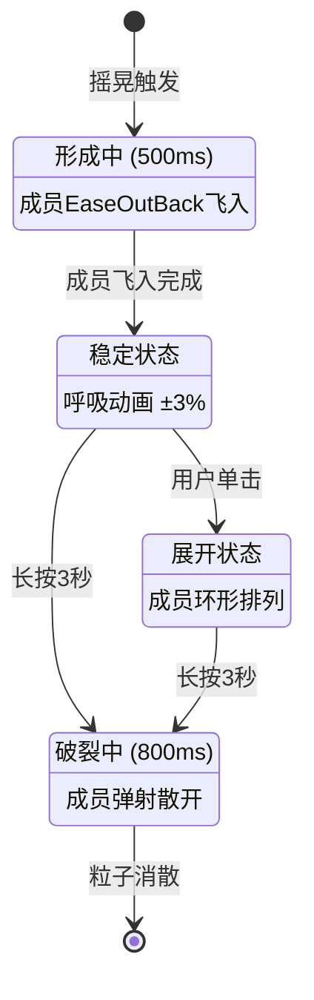

# RepoGalaxy 可视化系统设计文档

> 版本: v1.0  
> 状态: 已实现  
> 最后更新: 2026-03-14  
> 基于: Apple Watch App Library + 数据可视化 + 物理交互

---

## 1. 设计理念

### 1.1 核心隐喻

**"开源宇宙" (Open Source Universe)**

将 GitHub 仓库视为漂浮在星空中的星球/陨石，通过视觉编码让用户直观感知项目的多个维度。

| 概念 | 视觉表现 | 数据映射 |
|------|---------|---------|
| 星球 | 圆形气泡 | 单个仓库 |
| 星轨 | 六边形网格 | 时间和热度排序 |
| 星光 | 闪烁动画 | 活跃度 |
| 引力 | 物理碰撞 | 项目相似性 |
| 星团 | 聚类气泡 | 技术领域分组 |

### 1.2 设计参考

**Apple Watch App Library 设计精髓**:

```
调研发现的核心特点:
├── 蜂窝式六边形网格 (Honeycomb Grid)
│   └── 圆形图标紧密排列
│   └── 中心放大镜效果 (Focus Magnification)
│   └── 边缘图标自然缩小
├── 有机的布局
│   └── 非严格对齐网格
│   └── 允许轻微重叠
│   └── 视觉重心在中央
└── 交互反馈
    └── 点击放大
    └── 拖拽重组
    └── 物理惯性
```

**与传统网格的区别**:

| 特性 | 传统网格 | Apple Watch 蜂窝 |
|------|---------|-----------------|
| 对齐 | 严格行列对齐 | 六边形紧密排列 |
| 大小 | 统一尺寸 | 中心大边缘小 |
| 空间感 | 平面 | 球面投影感 |
| 交互 | 离散 | 连续有机 |

---

## 2. 布局算法

### 2.1 六边形网格系统

#### 2.1.1 坐标系统

**轴向坐标 (Axial Coordinates)**

```
        六边形网格坐标系
        
             上 (q, r-1)
              │
    左上 ─────┼───── 右上
   (q-1,r)   (q,r)   (q+1,r-1)
              │
    左下 ─────┼───── 右下
   (q-1,r+1) (q,r+1) (q+1,r)
              │
             下
            
坐标转换:
├── 轴向 → 像素
│   x = (q + r/2) × width
│   y = r × height × 3/4
│
└── 像素 → 轴向
    (屏幕中心为原点)
```

#### 2.1.2 环形布局算法

```csharp
// 第0环: 中心 1个
// 第1环: 周围 6个  
// 第2环: 外围 12个
// 第n环: 6×n 个

// 环数计算
总单元数 = 1 + 6 + 12 + ... + 6×n
        = 1 + 3×n×(n+1)

// 轴向坐标计算 (从顶部顺时针)
边 = index / ring      // 0-5
位置 = index % ring    // 0-(ring-1)

方向向量:
0: (0, -1)   // 上
1: (1, -1)   // 右上  
2: (1, 0)    // 右下
3: (0, 1)    // 下
4: (-1, 1)   // 左下
5: (-1, 0)   // 左上
```

#### 2.1.3 紧密排列策略

```
排列规则:
├── 间距系数: 0.85 (轻微重叠，更紧密)
├── 六边形宽高比: √3 ≈ 1.732
│   └── width = radius × 2
│   └── height = radius × √3
└── 奇偶行偏移: 交替排列
```

### 2.2 中心放大镜效果

#### 2.2.1 算法原理

**焦点缩放 (Focus+Context Magnification)**

```csharp
// 计算到中心距离
float distance = 气泡到屏幕中心距离;
float normalized = distance / 影响半径;  // 0-1

// 应用 EaseOutQuad 曲线
float t = 1f - normalized;
float magnification = 1f + 强度 × (1f - (1f-t)²);

// 效果
中心 (t=1):     放大 1.5x
边缘 (t=0):     保持 1.0x
中间:           平滑过渡
```

#### 2.2.2 视觉重心

```
放大镜效果创造视觉层次:
┌─────────────────────────────┐
│                             │
│      ╭─────────────╮       │  ← 中心气泡最大最清晰
│     ╱   ●━━━━━●    ╲      │
│    │  ━━●━中心━●━━  │      │
│     ╲   ●━━━━━●    ╱      │
│      ╰─────────────╯       │
│         ●━━━━━●            │  ← 边缘气泡较小
│                             │
└─────────────────────────────┘
```

### 2.3 双维度排序

#### 2.3.1 排序策略

```
Y轴 (垂直): 时间维度
├── 越往上越新
├── 按天/周分组
└── 新鲜度权重

X轴 (水平): 热度维度  
├── 越往左 Star 越多
├── 同一时间内按 Star 排序
└── 大小映射到半径

实现方式:
1. 按时间分桶 (bucket)
2. 桶内按 Star 降序
3. 映射到六边形网格
```

#### 2.3.2 与六边形网格的结合

```
时间+Star → 六边形坐标:

最新 (顶部)     Star多(左) ←────────→ Star少(右)
    │              ●━━━━━●━━━━━●
    │             ━━●━━━━━●━━━━━●━━
    ↓              ●━━━━━●━━━━━●
较旧 (底部)          ...

优势:
- 一眼看出新旧趋势
- 快速识别热门项目
- 大小差异自然呈现
```

---

## 3. 物理交互系统

### 3.1 慵懒漂浮 (Android 4.3 彩蛋风格)

#### 3.1.1 物理模型

```
力的构成:
├── 随机力 (Perlin Noise 简化)
│   └── 创造有机不规律运动
│   └── 避免机械感
├── 避让力 (软碰撞)
│   └── 防止严重重叠
│   └── 允许轻微接触
└── 摩擦力
    └── 0.99 (几乎无阻力)
    └── 保持长期运动

速度限制: 0.5 px/frame
运动特征:
- 缓慢漂移
- 不规律路径
- 相互避让
- 边界反弹
```

#### 3.1.2 实现细节

```csharp
每帧更新:
1. 随机加速度
   vx += Random(-1, 1) × RandomForce
   vy += Random(-1, 1) × RandomForce

2. 避让计算 (对所有其他气泡)
   if (距离 < 半径和 + 缓冲) {
       排斥力 = 强度 × (1 - 距离/阈值)
       速度 -= 方向 × 排斥力 / 质量
   }

3. 速度限制
   if (速度 > 最大速度) 速度 = 最大速度

4. 摩擦力
   速度 *= 摩擦力系数

5. 位置更新
   x += vx
   y += vy

6. 边界处理
   if (超出边界) {
       位置 = 边界
       速度 *= -弹性系数
   }
```

### 3.2 摇一摇聚类检测

#### 3.2.1 摇晃检测算法

```csharp
// 记录最近位置历史
Queue<(x, y, time)> 位置历史

// 计算方向改变
方向改变次数 = 0
for (i = 2 to 历史长度) {
    前方向 = 位置[i-1] - 位置[i-2]
    当前方向 = 位置[i] - 位置[i-1]
    
    // 点积为负 = 方向相反
    if (点积(前方向, 当前方向) < 0)
        方向改变次数++
}

// 计算频率
时间跨度 = 最新时间 - 最早时间
频率 = 方向改变次数 / 时间跨度

// 阈值判断
if (频率 > 3次/秒)
    触发摇晃事件
```

#### 3.2.2 摇一摇交互流程

```
用户拖拽气泡并快速摇晃
        ↓
系统检测摇晃动作 (3次/秒)
        ↓
气泡发光 + 颜色偏移 (Accent色)
        ↓
显示"摇晃中..."提示
        ↓
触发相似项目检索
        ↓
同类小气泡被吸引
        ↓
融合成大气泡
```

---

## 4. 七维视觉编码

### 4.1 编码维度表

| 视觉通道 | 数据维度 | 映射规则 | 实现方式 |
|---------|---------|---------|---------|
| **垂直位置 Y** | 更新时间 | 新→上, 旧→下 | 时间分桶排序 |
| **水平位置 X** | Star 数量 | 多→左, 少→右 | 桶内降序排列 |
| **半径大小** | Star 数量 | 非线性映射 | 0-100-200-500-1k-10k |
| **内部扇形** | 语言比例 | 饼图显示 | SkiaSharp 扇形绘制 |
| **亮度** | 提交新鲜度 | 新→亮(100%), 旧→暗(40%) | Alpha 通道调整 |
| **闪烁频率** | 综合活跃度 | 0-2Hz | Sin 波相位动画 |
| **呼吸缩放** | Fork 数量 | 幅度 0-0.15 | 正弦波周期 2-4s |

### 4.2 非线性映射函数

#### 4.2.1 Star 数 → 半径

```csharp
// 阶梯式非线性映射
// 避免小项目太小，大项目不过分大

float CalculateRadius(int stars) {
    return stars switch {
        0      => 16f,
        <= 100 => 24f,
        <= 200 => 32f,
        <= 500 => 40f,
        <= 1000 => 48f,
        <= 5000 => 56f,
        <= 10000 => 64f,
        <= 100000 => 72f,
        _      => 80f
    };
}

// 压缩原理:
// 0-100: 线性 (小项目可见)
// 100-10k: 对数压缩
// >10k: 上限 (避免遮挡)
```

#### 4.2.2 时间 → 亮度

```csharp
float CalculateBrightness(DateTime lastPushed) {
    var days = (Now - lastPushed).TotalDays;
    
    return days switch {
        <= 1   => 1.0f,   // < 24h: 最亮
        <= 7   => 0.85f,  // 1周: 明亮
        <= 30  => 0.70f,  // 1月: 适中
        <= 90  => 0.55f,  // 3月: 较暗
        _      => 0.40f   // > 3月: 暗淡
    };
}

// 视觉暗示:
// 亮的 = 活跃项目
// 暗的 = 可能过时
```

#### 4.2.3 活跃度 → 闪烁频率

```csharp
float CalculateTwinkleFrequency(Repository repo) {
    // 活跃度 = Star增速 + Issue活动
    float starGrowth = repo.Stars / 100f;
    float issueActivity = repo.OpenIssues / 50f;
    float recencyBonus = daysSinceUpdate < 7 ? 1f : 0f;
    
    float activity = starGrowth + issueActivity + recencyBonus;
    
    return activity switch {
        <= 0.5f => 0f,      // 不闪烁
        <= 2f   => 0.5f,    // 低频 0.5Hz
        <= 5f   => 1.0f,    // 中频 1Hz
        _       => 2.0f     // 高频 2Hz
    };
}

// 实现:
// phase += frequency × 2π × deltaTime
// brightness = 0.8 + 0.2 × sin(phase)
```

---

## 5. 实现架构

### 5.1 核心类图

```
┌─────────────────────────────────────────────────────────────┐
│                      BubbleCloudControl                      │
│                         (Avalonia)                           │
├─────────────────────────────────────────────────────────────┤
│ - List<BubbleItem> _bubbles                                  │
│ - HoneycombLayoutEngine _layoutEngine                        │
│ - BubblePhysicsEngine _physicsEngine                         │
├─────────────────────────────────────────────────────────────┤
│ + Layout(LayoutMode)                                         │
│ + UpdatePhysics(float deltaTime)                             │
│ + Render(SKCanvas)                                           │
└─────────────────────────────────────────────────────────────┘
                              │
        ┌─────────────────────┼─────────────────────┐
        ↓                     ↓                     ↓
┌───────────────┐    ┌───────────────┐    ┌───────────────┐
│ Honeycomb     │    │ BubblePhysics │    │ BubbleCloud   │
│ LayoutEngine  │    │ Engine        │    │ RenderOp      │
├───────────────┤    ├───────────────┤    ├───────────────┤
│ - Axial coords│    │ - Random force│    │ - SKCanvas    │
│ - Hex rings   │    │ - Repulsion   │    │ - Language pie│
│ - Magnification│   │ - Shake detect│    │ - Effects     │
├───────────────┤    ├───────────────┤    ├───────────────┤
│ + Layout()    │    │ + Update()    │    │ + Render()    │
│ + GetCenter() │    │ + Attract()   │    │ + DrawBubble()│
└───────────────┘    │ + Explode()   │    └───────────────┘
                     └───────────────┘
```

### 5.2 渲染流程

```
每帧渲染 (60fps):
├── 1. 更新物理 (PhysicsEngine.Update)
│   └── 随机力 + 避让力 + 摩擦力
│
├── 2. 更新动画 (UpdateAnimations)
│   └── 闪烁相位 += frequency × 2π × dt
│   └── 呼吸相位 += 2π × dt / period
│   └── Hover缩放插值
│
├── 3. 排序绘制 (Z-order)
│   └── 按半径从小到大
│   └── 大圆在后作为背景
│
└── 4. 绘制每个气泡
    ├── 语言扇形/单色圆
    ├── 光晕效果 (Fork呼吸)
    ├── 悬停边框
    └── 收藏标记
```

---

## 6. 性能优化

### 6.1 渲染优化

```
策略:
├── 对象池复用 (SKPaint, SKPath)
├── 脏矩形渲染 (只重绘变化区域)
├── 批量绘制 (减少状态切换)
└── GPU 加速 (SkiaSharp + OpenGL)

限制:
├── 最大气泡数: 100 (可配置)
├── 虚拟化: 只渲染视口内
└── LOD: 缩小时简化细节
```

### 6.2 物理优化

```
空间分割:
├── 均匀网格分割
├── 只检测相邻网格内的碰撞
└── 复杂度从 O(n²) → O(n)

时间步长:
├── 固定时间步长 (16ms)
├── 最大 deltaTime 限制 (50ms)
└── 防止卡顿后跳变
```

---

## 7. 聚类可视化实现

### 7.1 聚类状态机



### 7.2 视觉状态映射

| 状态 | 背景效果 | 成员表现 | 交互提示 |
|------|----------|----------|----------|
| Forming | 蓝色虚线圆环 | 向中心飞入 | 无 |
| Stable | 发光+呼吸 | 内部轻微浮动 | "按住解散" |
| Expanded | 外圈扩展 | 环形排列 | "选择项目" |
| Breaking | 粒子爆炸 | 向外弹射 | 无 |

### 7.3 粒子系统参数

```csharp
// 爆炸粒子配置
particleCount: 30-50
initialSpeed: 3-8 px/frame
gravity: 0.2 px/frame²
lifetime: 1.0s (decay: 0.015-0.03/s)
size: 2-6px
colors: [黄, 橙, 红] 渐变
```

### 7.4 发光效果层级

```
摇晃发光 (Shake Glow):
┌─────────────────────────────┐
│  Layer 1: 外层光晕 (橙色)   │
│  • MaskFilter blur 30px     │
│  • Alpha 80%                │
│  • 尺寸: radius + 15px      │
├─────────────────────────────┤
│  Layer 2: 核心发光 (金黄)   │
│  • MaskFilter blur 20px     │
│  • Alpha 150%               │
│  • 尺寸: radius + 8px       │
├─────────────────────────────┤
│  Layer 3: 边框高亮          │
│  • Stroke 3px               │
│  • Alpha 200%               │
│  • 尺寸: radius + 2px       │
└─────────────────────────────┘
```

---

## 8. 实现清单

| 组件 | 状态 | 文件 | 说明 |
|------|------|------|------|
| 摇晃检测 | ✅ | `BubblePhysicsEngine.cs` | 方向改变频率>3/sec |
| 发光效果 | ✅ | `ShakeVisualState` | 3层渐变发光 |
| 进度环 | ✅ | `BubbleCloudRenderOperation.cs` | 黄→橙→红 |
| 粒子系统 | ✅ | `Particle` class | 30-50粒子+重力 |
| 聚类动画 | ✅ | `ClusterManager.cs` | EaseOutBack飞入 |
| 多选面板 | ✅ | `ClusterSelectionPanel.axaml` | 网格布局 |
| Toast通知 | ✅ | `ToastNotificationService.cs` | 右下角滑出 |

---

## 9. 设计决策记录

| 日期 | 决策 | 理由 | 替代方案 |
|------|------|------|---------|
| 2026-03-14 | 轴向坐标系 | 六边形网格标准方案 | 立方体坐标 (冗余) |
| 2026-03-14 | 0.85 间距系数 | 允许轻微重叠更紧密 | 1.0 相切 (太松散) |
| 2026-03-14 | EaseOutQuad 放大镜 | 自然焦点过渡 | 线性 (生硬) |
| 2026-03-14 | 3次/秒摇晃阈值 | 明显但不敏感 | 5次 (太敏感) |
| 2026-03-14 | 0.5px 最大速度 | 慵懒感 | 2px (太快) |
| 2026-03-14 | 阶梯式 Star 映射 | 小项目可见 | 线性 (小项目消失) |
| 2026-03-14 | 聚类最大15个 | 避免过大混乱 | 20个 (屏幕拥挤) |
| 2026-03-14 | 长按3秒破裂 | 足够确认但不过长 | 2秒 (易误触) |

---

## 8. 参考资料

### 8.1 算法参考

- **Hexagonal Grids** (Red Blob Games): 六边形网格权威教程
- **Apple Watch Human Interface Guidelines**: 官方设计规范
- **Focus+Context Visualization**: 放大镜效果理论基础

### 8.2 代码实现

- **SwiftUI HexGrid Layout**: SwiftUI Layout Protocol 实现参考
- **D3.js Force Simulation**: 物理力导向图参考
- **SkiaSharp Samples**: 图形渲染最佳实践

---

**本文档详细记录了 RepoGalaxy 可视化系统的设计思路、算法原理和实现细节，是理解和维护代码的核心参考。**
