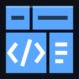
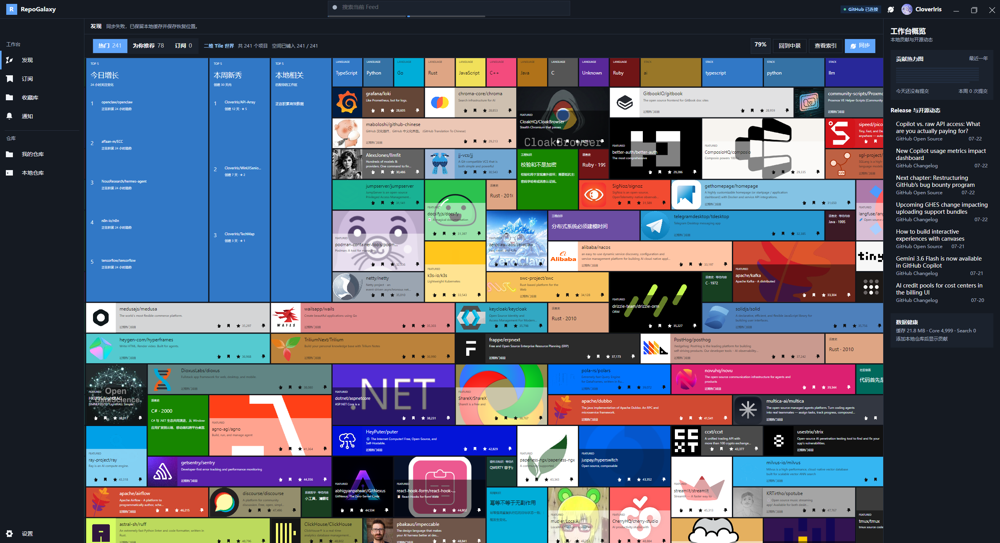
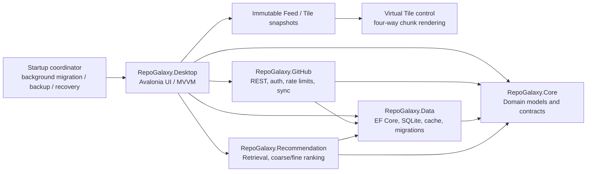

<div align="center">
  
  <h1>RepoGalaxy</h1>
  <p><strong>A local-first desktop client for discovering, subscribing to, and intelligently ranking GitHub repositories.</strong></p>
  <p>
    
    
    
    
    
    
    
    <a href="LICENSE"></a>
  </p>
  <p><strong>Language / 语言</strong><br /><a href="README.md">简体中文</a> · <strong>English</strong></p>
</div>

## What is RepoGalaxy?

RepoGalaxy turns the accidental discovery of a useful repository into a repeatable workflow: discover projects, understand why they were recommended, subscribe to technologies you care about, save repositories, and receive updates when important releases arrive.

It is not a thin wrapper around the GitHub website. RepoGalaxy follows a local-first architecture and stores feeds, subscriptions, saved repositories, reading feedback, API cache entries, and ranking batches in local SQLite. The UI renders local snapshots first and incrementally synchronizes in the background. Apart from GitHub itself, the app requires no Redis, Docker, WSL, or self-hosted service.

Windows desktop is the primary platform today. The interface uses Avalonia's official FluentTheme as its control foundation, with a square Windows 10 Metro / Fluent 1 visual language for the spatial feed.



## Highlights

- **Three-scale discovery** — move continuously between a semantic technology index, a two-dimensional Tile world, and immersive repository details; X/Y panning and Z-axis zoom remain independent.
- **Dense GitHub feeds** — explore Trending, For You, and Subscriptions with local search, stable Tile coordinates, semantic filters, and lazy-loaded details.
- **Explainable two-stage ranking** — candidate retrieval is followed by coarse ranking, fine ranking, and diversity reranking. Reasons, impressions, and feedback are recorded, while presets, weights, exploration rate, and temperature remain adjustable.
- **Reliable local data foundation** — EF Core migrations, SQLite WAL, database backups, integrity checks, bounded L1 memory cache, and persistent SQLite cache provide a stale-while-revalidate pipeline.
- **Auditable GitHub sessions** — Device Flow is the default sign-in path, with PAT and guarded local-loopback alternatives. Credentials are stored only after verification and are protected with DPAPI CurrentUser on Windows.
- **Rate-aware synchronization** — Core and Search budgets are tracked independently; checkpoints, conditional requests, backoff, and cancellation prevent unbounded API work.
- **Repository reading and local development** — details open on a safely rendered README. RepoGalaxy can discover Visual Studio, VS Code, and JetBrains IDEs, then clone and open a repository when needed.
- **Local activity and official news** — the side rail combines local Git contributions, stable releases from saved repositories, GitHub Blog, and GitHub Changelog feeds.

## Interaction model

The Discover page is a navigable two-dimensional content map rather than a conventional endless vertical list:

1. **Semantic index** — a curated view of languages and technology stacks that actually occur in the current feed, local repositories, or subscriptions.
2. **Tile world** — repositories, languages, stacks, charts, and tips occupy stable coordinates. Virtual chunks are drawn on demand and real content fills compatible slots in place.
3. **Immersive detail** — focusing a Tile transitions into structured details ordered as README, Overview, Languages, Topics, Releases, and Recommendation Reasons.

The mouse wheel or a touchpad pinch controls zoom, while dragging or a two-finger gesture pans the camera. Local search moves the closest matching item to the viewport center without implicitly spending GitHub API quota.

## Architecture



| Project | Responsibility |
| --- | --- |
| `RepoGalaxy.Core` | Domain models and contracts for repositories, feeds, subscriptions, authentication, caching, Tiles, details, and ranking. |
| `RepoGalaxy.Data` | SQLite, EF Core migrations, persistent caching, backup and recovery, and data service implementations. |
| `RepoGalaxy.GitHub` | GitHub REST client, OAuth, Device Flow, request budgets, pagination, and synchronization orchestration. |
| `RepoGalaxy.Recommendation` | Candidate generation, feature computation, coarse and fine ranking, diversity, and configurable reranking. |
| `RepoGalaxy.Desktop` | Avalonia desktop app, page view models, spatial Tile controls, sign-in, and operating-system integration. |
| `tests/*` | Unit, integration, and Headless UI tests for Core, Data, Desktop, GitHub, and Recommendation. |

The app first presents a centered, draggable lightweight startup window. A startup coordinator then performs database checks, migrations, backups, and abandoned-workspace cleanup in the background. The main data flow is local-snapshot first: the UI consumes immutable Feed/Tile snapshots; synchronization writes network responses into the cache and business database; the ranking pipeline creates a new batch; and the UI atomically swaps snapshots. The virtual Tile control queries visible real content in signed world coordinates and continuously draws deterministic `12×8` chunks in all four directions. Pan, zoom, and Resize only update the viewport and camera matrix—never the database, network, ranking pipeline, or semantic catalog. After explicit synchronization or reranking, the camera stays anchored to the prior center item, or falls back to the new data-island center.

## Get and run RepoGalaxy

### Requirements

- Windows 10/11, currently the primary supported platform.
- [.NET 10 SDK](https://dotnet.microsoft.com/download/dotnet/10.0). [`global.json`](global.json) pins `10.0.302` and permits the latest patch in the same feature band.
- Visual Studio with .NET 10 support and the **.NET desktop development** workload.
- Git, both for cloning RepoGalaxy and for its local-repository features.

### Clone

```powershell
git clone https://github.com/CloverIris/RepoGalaxy.git
cd RepoGalaxy
```

Alternatively, choose **Code → Download ZIP** on the GitHub repository page and extract the archive.

### Visual Studio

1. Open `RepoGalaxy.slnx`.
2. Set `RepoGalaxy.Desktop` as the startup project.
3. Wait for NuGet restore, then press `F5` to debug or `Ctrl+F5` to run without debugging.

A responsive startup page appears first, while database migrations run automatically in the background; no manual SQLite setup is required.

### Command line

```powershell
dotnet restore
dotnet build RepoGalaxy.slnx
dotnet test RepoGalaxy.slnx
dotnet run --project src/RepoGalaxy.Desktop
```

To produce a Windows x64 Release build:

```powershell
dotnet publish src/RepoGalaxy.Desktop/RepoGalaxy.Desktop.csproj `
  -c Release -r win-x64 --self-contained false
```

### GitHub sign-in

OAuth Device Flow is the default entry point. RepoGalaxy establishes a session and stores an encrypted credential only after the temporary credential successfully calls `/user`. Guest mode can still read public data, but uses a deliberately more conservative automatic-request policy.

Advanced local-loopback sign-in appears only when a Client Secret is configured on the machine:

```powershell
$env:REPOGALAXY_GITHUB_CLIENT_SECRET = "your-local-secret"
```

Keep the secret in secure local configuration and never commit it. The app still accepts an older misspelled environment-variable alias for compatibility, but all new setups should use the correct name above.

### Local data

RepoGalaxy stores its database, logs, cache, and backups in the current user's local application-data directory. The database is created from one `InitialFresh` baseline with WAL, foreign keys, busy waiting, and full synchronization. The app does not read or migrate databases, layouts, cache payloads, or credential keys from an older data generation. Cache cleanup removes only reconstructible network responses; it never removes Feed data, Tile layouts, saved repositories, subscriptions, preferences, or business history. Signing out clears the credential and private account-derived data.

## Development and quality checks

Run at least the following before submitting a change:

```powershell
dotnet format RepoGalaxy.slnx --verify-no-changes
dotnet build RepoGalaxy.slnx -c Release
dotnet test RepoGalaxy.slnx -c Release
dotnet list RepoGalaxy.slnx package --vulnerable --include-transitive
```

When changing database models, keep one baseline for the current data generation. An incompatible schema change must explicitly start a new generation and reset local data instead of adding legacy conversion branches. For UI work, validate light and dark themes, keyboard focus, common window widths, and Avalonia Headless tests. No gesture path should issue network or database requests.

## Contributing

1. Open or discuss an Issue before a substantial feature so its user value, boundaries, and migration impact are clear.
2. Fork the repository and work from a clearly named feature branch.
3. Preserve layer boundaries: domain contracts belong in Core, persistence in Data, GitHub protocol work in GitHub, algorithms in Recommendation, and UI state in Desktop.
4. Add tests for behavioral changes. Security, authentication, caching, migrations, and ranking require failure and cancellation coverage.
5. Ensure formatting, the Release build, the full test suite, and the NuGet vulnerability audit all pass.
6. Open a Pull Request describing the problem, solution, validation, and any visible UI or database changes.

Never include tokens, PATs, OAuth codes, state values, Client Secrets, private repository names, or sensitive URLs with query strings in Issues, logs, screenshots, or commits.

## License

RepoGalaxy is released under the [MIT License](LICENSE). You may use, copy, modify, merge, publish, and distribute the software under its terms; retain the copyright and permission notice in copies or substantial portions.

## Acknowledgements

Thank you to the maintainers and contributors across Avalonia, .NET, GitHub, and the wider open-source ecosystem—their work gives RepoGalaxy a dependable foundation on which to grow.
