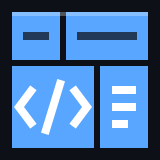
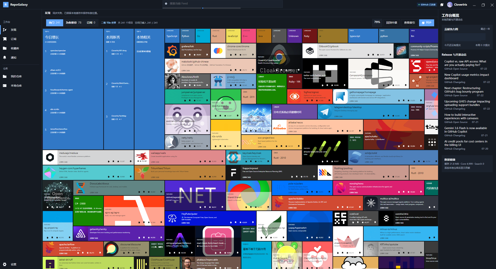
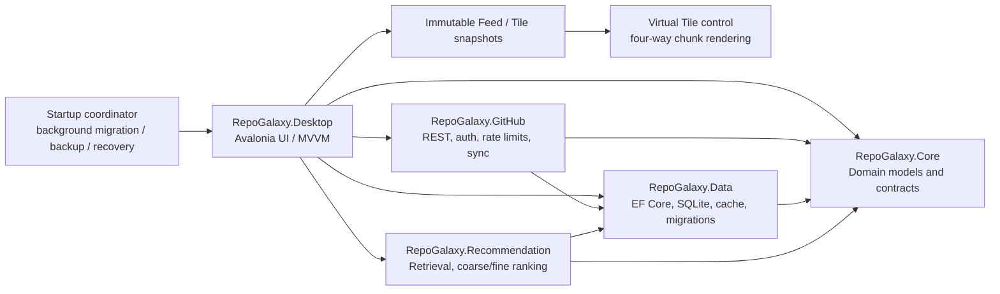

<div align="center">
  
  <h1>RepoGalaxy</h1>
  <p><strong>Turn GitHub repository discovery, tracking, and reading into your local developer workspace.</strong></p>
  <p>
    
    
    
    
    
    
    
    <a href="LICENSE"></a>
  </p>
  <p><strong>Language / 语言</strong><br /><a href="README.md">简体中文</a> · <strong>English</strong></p>
</div>

## What is RepoGalaxy?

RepoGalaxy is a desktop workspace for exploring GitHub and keeping track of repositories that matter to you. Discover projects through trending and personalized feeds, follow languages and technology stacks, see why a repository was recommended, then add it to your subscriptions or saved list.

Discovery does not stop at a link. Explore repositories on a spatial map, read safely rendered READMEs, check releases and topics, and clone a project locally to open it in the development tools you already use.

RepoGalaxy keeps feeds, subscriptions, saved repositories, reading feedback, and cache entries in a local SQLite database. Existing content appears first while synchronization runs in the background; recommendations can adapt to your interests and feedback over time. GitHub is the only service it needs—there is no database, container, or self-hosted backend to set up.



## Highlights

- **Explore repositories like a map** — move from a language and technology index into a two-dimensional repository world, zooming from broad themes to project details.
- **Keep the GitHub signals you care about together** — switch between Trending, For You, and Subscriptions, then narrow results with local search and semantic filters.
- **Understand the recommendations** — inspect why a project appears; ranking considers your interests, reading feedback, and content diversity, with adjustable preferences.
- **Build your own repository library** — subscribe to technologies, save repositories, follow important releases, and clone projects into your local development environment.
- **Local-first, ready on launch** — feeds, subscriptions, saved items, and feedback live in SQLite. RepoGalaxy shows a local snapshot first, synchronizes in the background, and provides backup and integrity checks.
- **Keep synchronization in check** — track GitHub Core and Search budgets separately, with pagination checkpoints, conditional requests, backoff, and cancellation.
- **Protect account credentials** — Device Flow is the default sign-in method; credentials are saved only after verification and protected with Windows DPAPI or macOS Keychain.
- **Follow project activity without losing context** — see local Git contributions, releases from saved repositories, and official GitHub Blog and Changelog updates in one side rail.

## Interaction model

Discover is a navigable two-dimensional content map rather than an endless list, guiding you from the technologies you follow to the projects you want to understand:

1. **Semantic index** — a curated view of languages and technology stacks that actually occur in the current feed, local repositories, or subscriptions.
2. **Tile world** — repositories, languages, stacks, charts, and tips occupy stable coordinates. Virtual chunks are drawn on demand and real content fills compatible slots in place.
3. **Immersive detail** — focusing a Tile transitions into structured details ordered as README, Overview, Languages, Topics, Releases, and Recommendation Reasons.

The mouse wheel or a touchpad pinch controls zoom, while dragging or a two-finger gesture pans the camera. Local search moves the closest matching item to the viewport center without implicitly spending GitHub API quota.

## Architecture


```mermaid
flowchart LR
    Startup["Startup coordinator\nbackground migration / backup / recovery"] --> Desktop["RepoGalaxy.Desktop\nAvalonia UI / MVVM"]
    Desktop --> Snapshot["Immutable Feed / Tile snapshots"]
    Snapshot --> World["Virtual Tile control\nfour-way chunk rendering"]
    Desktop --> Core["RepoGalaxy.Core\nDomain models and contracts"]
    Desktop --> GitHub["RepoGalaxy.GitHub\nREST, auth, rate limits, sync"]
    Desktop --> Data["RepoGalaxy.Data\nEF Core, SQLite, cache, migrations"]
    Desktop --> Ranking["RepoGalaxy.Recommendation\nRetrieval, coarse/fine ranking"]
    GitHub --> Core
    GitHub --> Data
    Data --> Core
    Ranking --> Core
    Ranking --> Data
```

| Project | Responsibility |
| --- | --- |
| `RepoGalaxy.Core` | Domain models and contracts for repositories, feeds, subscriptions, authentication, caching, Tiles, details, and ranking. |
| `RepoGalaxy.Data` | SQLite, EF Core migrations, persistent caching, backup and recovery, and data service implementations. |
| `RepoGalaxy.GitHub` | GitHub REST client, OAuth, Device Flow, request budgets, pagination, and synchronization orchestration. |
| `RepoGalaxy.Recommendation` | Candidate generation, feature computation, coarse and fine ranking, diversity, and configurable reranking. |
| `RepoGalaxy.Desktop` | Avalonia desktop app, page view models, spatial Tile controls, sign-in, and operating-system integration. |
| `tests/*` | Unit, integration, and Headless UI tests for Core, Data, Desktop, GitHub, and Recommendation. |

The app first presents a centered, draggable lightweight startup window. A startup coordinator then performs database checks, migrations, backups, and abandoned-workspace cleanup in the background. The main data flow is local-snapshot first: the UI consumes immutable Feed/Tile snapshots; synchronization writes network responses into the cache and business database; the ranking pipeline creates a new batch; and the UI atomically swaps snapshots. The virtual Tile control queries visible real content in signed world coordinates and continuously draws deterministic `12×8` chunks in all four directions. Pan, zoom, and Resize only update the viewport and camera matrix—never the database, network, ranking pipeline, or semantic catalog. After explicit synchronization or reranking, the camera stays anchored to the prior center item, or falls back to the new data-island center.

## Get, run, and package RepoGalaxy

### Requirements

- Windows 10/11, macOS 12+ (the macOS release targets Apple Silicon), or x86_64 Linux.
- [.NET 10 SDK](https://dotnet.microsoft.com/download/dotnet/10.0). [`global.json`](global.json) pins `10.0.302` and permits the latest patch in the same feature band.
- Git, both for cloning RepoGalaxy and for its local-repository features.

### Clone

```powershell
git clone https://github.com/CloverIris/RepoGalaxy.git
cd RepoGalaxy
```

Alternatively, choose **Code → Download ZIP** on the GitHub repository page and extract the archive.

### Run from source

Open `RepoGalaxy.slnx` in Visual Studio, set `RepoGalaxy.Desktop` as the startup project, wait for NuGet restore, and press `F5`. Or use the command line:

```bash
dotnet restore
dotnet build RepoGalaxy.slnx
dotnet run --project src/RepoGalaxy.Desktop
```

The app presents an interactive startup screen while database migrations run automatically in the background; no manual SQLite setup is needed.

### Create platform release packages

Each platform has its own release command. Windows can be published from a .NET 10 development environment; the macOS and Linux packaging scripts must run on their respective operating systems.

#### Windows 10/11 (x64)

Run this in PowerShell from the repository root to create a self-contained, single-file executable:

```powershell
dotnet publish src/RepoGalaxy.Desktop/RepoGalaxy.Desktop.csproj -c Release -r win-x64 --self-contained true -o release/1.0.0-preview.1-win-x64 -p:PublishSingleFile=true -p:IncludeNativeLibrariesForSelfExtract=true -p:EnableCompressionInSingleFile=true -p:PublishTrimmed=false -p:DebugType=None -p:DebugSymbols=false
```

Run `RepoGalaxy.Desktop.exe` from the output directory. This package targets x64 Windows and does not require users to install the .NET Runtime separately.

#### macOS (Apple Silicon or Intel)

Install the .NET 10 SDK on macOS, then run the release script from the repository root. It targets Apple Silicon by default; pass `osx-x64` to build for Intel Macs:

```bash
bash scripts/publish-release-macos.sh
# Intel Mac:
bash scripts/publish-release-macos.sh osx-x64
```

The script creates an `.app` bundle and DMG in `release/1.0.0-preview.1-osx-arm64/` or `release/1.0.0-preview.1-osx-x64/`. Open the DMG and drag RepoGalaxy to Applications. This preview is ad-hoc signed, not notarized by Apple; if Gatekeeper blocks the first launch, Control-click the app in Finder, choose **Open**, and confirm.

The macOS app stores credentials in Keychain and keeps its database and logs in `~/Library/Application Support/RepoGalaxy`.

#### Linux (x86_64 AppImage)

On Ubuntu 22.04 or a compatible x86_64 Linux host, install the .NET 10 SDK and `appimagetool`, then run from the repository root:

```bash
bash scripts/publish-release-linux.sh
```

The script creates an AppImage and SHA-256 checksum in `release/1.0.0-preview.1-linux-x64/`. From the repository root, make it executable and launch it:

```bash
chmod +x release/1.0.0-preview.1-linux-x64/RepoGalaxy-1.0.0-preview.1-linux-x64.AppImage
./release/1.0.0-preview.1-linux-x64/RepoGalaxy-1.0.0-preview.1-linux-x64.AppImage
```

You can also launch it by double-clicking in a file manager. Linux desktop graphics libraries must be provided by the host. Linux Secret Service credential storage is not implemented in this preview, so GitHub sign-in is unavailable; guest mode remains usable.

### GitHub sign-in

OAuth Device Flow is the default entry point. RepoGalaxy establishes a session and stores an encrypted credential only after the temporary credential successfully calls `/user`. Guest mode can still read public data, but uses a deliberately more conservative automatic-request policy.

Advanced local-loopback sign-in appears only when a Client Secret is configured on the machine:

```powershell
$env:REPOGALAXY_GITHUB_CLIENT_SECRET = "your-local-secret"
```

Keep the secret in secure local configuration and never commit it. The app still accepts an older misspelled environment-variable alias for compatibility, but all new setups should use the correct name above.

### Local data

RepoGalaxy stores its database, logs, cache, and backups in the current user's local application-data directory. The database is created from one `InitialFresh` baseline with WAL, foreign keys, busy waiting, and full synchronization. The app does not read or migrate databases, layouts, cache payloads, or credential keys from an older data generation. Cache cleanup removes only reconstructible network responses; it never removes Feed data, Tile layouts, saved repositories, subscriptions, preferences, or business history. Signing out clears the credential and private account-derived data.

## Development and quality checks

Run at least the following before submitting a change:

```powershell
dotnet format RepoGalaxy.slnx --verify-no-changes
dotnet build RepoGalaxy.slnx -c Release
dotnet test RepoGalaxy.slnx -c Release
dotnet list RepoGalaxy.slnx package --vulnerable --include-transitive
```

When changing database models, keep one baseline for the current data generation. An incompatible schema change must explicitly start a new generation and reset local data instead of adding legacy conversion branches. For UI work, validate light and dark themes, keyboard focus, common window widths, and Avalonia Headless tests. No gesture path should issue network or database requests.

## Contributing

1. Open or discuss an Issue before a substantial feature so its user value, boundaries, and migration impact are clear.
2. Fork the repository and work from a clearly named feature branch.
3. Preserve layer boundaries: domain contracts belong in Core, persistence in Data, GitHub protocol work in GitHub, algorithms in Recommendation, and UI state in Desktop.
4. Add tests for behavioral changes. Security, authentication, caching, migrations, and ranking require failure and cancellation coverage.
5. Ensure formatting, the Release build, the full test suite, and the NuGet vulnerability audit all pass.
6. Open a Pull Request describing the problem, solution, validation, and any visible UI or database changes.

Never include tokens, PATs, OAuth codes, state values, Client Secrets, private repository names, or sensitive URLs with query strings in Issues, logs, screenshots, or commits.

## License

RepoGalaxy is released under the [MIT License](LICENSE). You may use, copy, modify, merge, publish, and distribute the software under its terms; retain the copyright and permission notice in copies or substantial portions.

## Acknowledgements

Thank you to the maintainers and contributors across Avalonia, .NET, GitHub, and the wider open-source ecosystem—their work gives RepoGalaxy a dependable foundation on which to grow.
