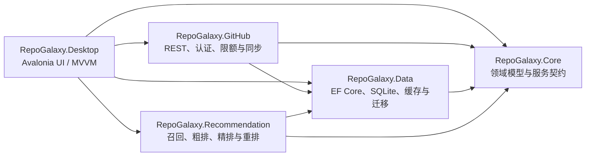

<div align="center">
  
  <h1>RepoGalaxy</h1>
  <p><strong>一个本地优先、面向开发者的 GitHub 发现、订阅与智能推荐桌面客户端。</strong></p>
  <p>
    
    
    
    
    
    
    
    
  </p>
  <p><strong>语言 / Language</strong><br /><strong>简体中文</strong> · <a href="README.en.md">English</a></p>
</div>

## RepoGalaxy 是什么

RepoGalaxy 希望把“偶然刷到一个好仓库”变成一套可以持续使用的工作流：发现项目、理解推荐理由、订阅感兴趣的技术方向、保存仓库，并在重要 Release 到来时得到提醒。

它不是 GitHub 网页的简单套壳。应用采用本地优先架构，将 Feed、订阅、收藏、阅读反馈、API 缓存和推荐批次保存在本机 SQLite 中；界面可以先呈现本地快照，再在后台增量同步。除 GitHub 服务本身外，运行 RepoGalaxy 不需要 Redis、Docker、WSL 或自建服务。

当前产品以 Windows 桌面为首要平台，使用 Avalonia 官方 FluentTheme 作为控件基础，并以 Windows 10 Metro / Fluent 1 的方角视觉构建空间化信息流。

## 核心能力

- **三尺度发现体验**：在技术索引、二维 Tile 世界和沉浸式仓库详情之间连续缩放；X/Y 平移与 Z 轴缩放相互独立。
- **高密度 GitHub Feed**：提供热门、为你推荐和订阅三个来源，支持本地搜索、稳定 Tile 坐标、语义筛选和详情懒加载。
- **可解释两阶段推荐**：候选召回后依次进行粗排、精排与多样性重排，并记录推荐依据、曝光和反馈；设置页可调整预设、权重、探索比例和温度。
- **可靠的本地数据底座**：EF Core migrations、SQLite WAL、数据库备份、完整性检查、有界 L1 缓存和 SQLite 持久缓存共同提供 stale-while-revalidate 数据链路。
- **清晰的 GitHub 会话闭环**：Device Flow 为默认登录方式，也支持 PAT 和受控的本地回环；凭证经验证后才保存，并在 Windows 上使用 DPAPI CurrentUser 加密。
- **额度感知的同步**：Core 与 Search 限额分别计量；分页检查点、条件请求、失败退避和取消机制避免无边界请求。
- **仓库阅读与本地开发**：详情优先展示经过安全处理的 README；应用可发现 Visual Studio、VS Code 和 JetBrains IDE，并在需要时克隆仓库后打开。
- **本地贡献与资讯侧栏**：聚合本地 Git 贡献、收藏仓库正式 Release、GitHub Blog 与 GitHub Changelog 官方信息源。

## 交互模型

发现页不是传统的无限纵向列表，而是一张可漫游的二维内容地图：

1. **远景索引**：精选当前 Feed、本地仓库与订阅中真实出现的语言和技术栈。
2. **中景 Tile 世界**：仓库、语言、技术栈、榜单与 Tips 以稳定坐标拼贴；虚拟区块按需绘制，真实内容原位填充。
3. **近景详情**：聚焦 Tile 后逐步进入结构化详情，优先呈现 README、概览、语言、主题、Release 和推荐依据。

鼠标滚轮或触摸板捏合控制缩放，拖动和双指平移控制二维相机。搜索会在本地匹配后将最近的结果移动到视口中心，不会隐式消耗 GitHub API 额度。

## 项目架构



| 项目 | 职责 |
| --- | --- |
| `RepoGalaxy.Core` | 仓库、Feed、订阅、认证、缓存、Tile、详情和推荐的领域模型与接口。 |
| `RepoGalaxy.Data` | SQLite 数据库、EF Core migrations、持久缓存、备份恢复及数据服务实现。 |
| `RepoGalaxy.GitHub` | GitHub REST 客户端、OAuth、Device Flow、请求预算、分页和同步编排。 |
| `RepoGalaxy.Recommendation` | 候选生成、特征计算、粗排、精排、多样性和可调重排。 |
| `RepoGalaxy.Desktop` | Avalonia 桌面应用、页面 ViewModel、空间 Tile 控件、登录和系统集成。 |
| `tests/*` | Core、Data、Desktop、GitHub 和 Recommendation 的单元、集成与 Headless UI 测试。 |

主要数据流遵循“本地快照优先”：UI 读取不可变 Feed 快照，后台同步把网络响应写入缓存和业务数据库，推荐管线生成新的排名批次，最后以差异更新提交给 UI。相机手势不执行数据库、网络或排名计算。

## 获取与运行

### 环境要求

- Windows 10/11（当前首要支持平台）。
- [.NET 10 SDK](https://dotnet.microsoft.com/download/dotnet/10.0)。仓库通过 [`global.json`](global.json) 固定到 `10.0.302`，并允许同一功能带的最新补丁。
- Visual Studio：安装支持 .NET 10 的版本及“.NET 桌面开发”工作负载。
- Git：用于克隆本仓库，以及 RepoGalaxy 内的本地仓库能力。

### 克隆仓库

```powershell
git clone https://github.com/CloverIris/RepoGalaxy.git
cd RepoGalaxy
```

也可以在 GitHub 仓库页面选择 **Code → Download ZIP**，解压后进入项目目录。

### 使用 Visual Studio

1. 打开 `RepoGalaxy.slnx`。
2. 将 `RepoGalaxy.Desktop` 设为启动项目。
3. 等待 NuGet 还原完成，然后按 `F5` 调试或按 `Ctrl+F5` 运行。

应用启动时会自动执行数据库迁移，因此不需要手动创建 SQLite 数据库。

### 使用命令行

```powershell
dotnet restore
dotnet build RepoGalaxy.slnx
dotnet test RepoGalaxy.slnx
dotnet run --project src/RepoGalaxy.Desktop
```

创建 Windows x64 Release 输出：

```powershell
dotnet publish src/RepoGalaxy.Desktop/RepoGalaxy.Desktop.csproj `
  -c Release -r win-x64 --self-contained false
```

### 登录 GitHub

默认入口使用 OAuth Device Flow。应用只有在使用临时凭证成功调用 `/user` 后，才会建立登录会话并保存加密凭证。游客模式仍可浏览公开数据，但自动请求和额度更保守。

高级本地回环登录仅在本机配置 Client Secret 后显示：

```powershell
$env:REPOGALAXY_GITHUB_CLIENT_SECRET = "your-local-secret"
```

Secret 只应保存在本机安全配置中，不要提交到仓库。项目仍兼容早期拼写错误的环境变量别名，但新配置应始终使用上面的正确名称。

### 本地数据

RepoGalaxy 将数据库、日志、缓存和备份写入当前用户的本地应用数据目录。v3 数据库使用 EF Core migrations，并启用 WAL、外键、忙等待和完整同步策略。清理缓存不会删除收藏、订阅、偏好或业务历史；退出登录会清除认证凭证及账号私有派生数据。

## 开发与质量检查

提交改动前至少运行：

```powershell
dotnet format RepoGalaxy.slnx --verify-no-changes
dotnet build RepoGalaxy.slnx -c Release
dotnet test RepoGalaxy.slnx -c Release
dotnet list RepoGalaxy.slnx package --vulnerable --include-transitive
```

涉及数据库模型时，请创建增量 migration，并验证应用可以从上一版本数据库升级。涉及 UI 时，请同时检查深浅主题、键盘焦点、常见窗口宽度和 Avalonia Headless 测试。任何手势路径都不应发起网络或数据库请求。

## 如何贡献

1. 在开始较大的功能前先创建或讨论 Issue，明确用户价值、边界和数据迁移影响。
2. Fork 仓库并从清晰命名的功能分支开始工作。
3. 保持分层边界：领域契约放在 Core，持久化放在 Data，GitHub 协议放在 GitHub，算法放在 Recommendation，UI 状态放在 Desktop。
4. 为行为变化补充测试；安全、认证、缓存、迁移和推荐逻辑需要覆盖失败与取消路径。
5. 确保格式化、Release 构建、全量测试和 NuGet 漏洞审计通过。
6. 提交 Pull Request，说明问题、方案、验证结果以及任何可见 UI 或数据库变化。

请勿在 Issue、日志、截图或提交中包含 Token、PAT、OAuth Code、State、Client Secret、私有仓库名称或带查询串的敏感 URL。

## 许可证

仓库当前**尚未包含开源许可证文件**。在许可证正式确定前，请不要假定代码可按 MIT、Apache-2.0 或其他开源许可证使用、复制或再分发。贡献代码前也请先留意后续的许可证说明。

## 致谢

感谢 Avalonia、.NET、GitHub 及整个开源生态中的维护者和贡献者，让 RepoGalaxy 得以站在可靠工具链之上继续前进。
