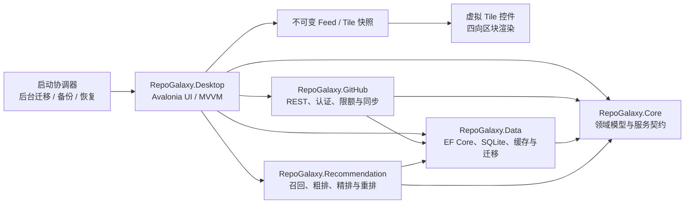

<div align="center">
  
  <h1>RepoGalaxy</h1>
  <p><strong>把 GitHub 仓库发现、跟踪与阅读，整理成你的本地开发工作台。</strong></p>
  <p>
    
    
    
    
    
    
    
    <a href="LICENSE"></a>
  </p>
  <p><strong>语言 / Language</strong><br /><strong>简体中文</strong> · <a href="README.en.md">English</a></p>
</div>

## RepoGalaxy 是什么

RepoGalaxy 是面向开发者的 GitHub 探索与仓库管理桌面应用。它帮你从热门项目和个性化推荐中发现值得关注的仓库，沿着语言与技术栈继续探索，读懂推荐理由，再把感兴趣的项目加入订阅或收藏。

发现不是终点：你可以在空间化的信息地图中浏览仓库，在详情页阅读经过安全处理的 README、查看 Release 与项目主题，并从应用中把仓库克隆到本地、交给熟悉的开发工具打开。

RepoGalaxy 以本机 SQLite 保存 Feed、订阅、收藏、阅读反馈与缓存。启动时优先呈现已有内容，网络同步在后台进行；推荐排序也会结合你的兴趣和反馈逐步调整。除 GitHub 服务外，不需要额外部署数据库、容器或自建后端，让发现与整理工作流留在自己的桌面上。


## 核心能力

- **像逛地图一样发现项目**：从语言与技术栈索引进入二维仓库世界，在远景浏览主题、近景阅读项目详情；平移和缩放都围绕内容进行。
- **把关注流集中在一处**：在热门、为你推荐和订阅 Feed 之间切换，用本地搜索与语义筛选快速找到项目。
- **知道推荐从何而来**：查看推荐理由；排序综合兴趣、阅读反馈与内容多样性，并可在设置中调整推荐偏好。
- **建立自己的仓库清单**：订阅技术方向、收藏仓库、跟踪重要 Release，并在需要时克隆项目到本地开发环境。
- **本地优先，启动即有内容**：Feed、订阅、收藏和反馈保存在 SQLite；先显示本地快照，再于后台同步，并提供备份与完整性检查。
- **让同步更可控**：分别跟踪 GitHub Core 与 Search 请求额度，通过分页检查点、条件请求、退避与取消机制避免无界请求。
- **保护账号凭证**：默认通过 OAuth Device Flow 登录；验证成功后才保存凭证，在 Windows 使用 DPAPI、macOS 使用钥匙串。
- **顺手查看项目动态**：在同一侧栏查看本地 Git 贡献、收藏仓库的正式 Release，以及 GitHub Blog 和 Changelog。

## 交互模型

发现页不是一眼望不到头的列表，而是一张可漫游的二维内容地图，让你从“我关注什么技术”自然走到“这个项目值得读什么”：

1. **远景索引**：精选当前 Feed、本地仓库与订阅中真实出现的语言和技术栈。
2. **中景 Tile 世界**：仓库、语言、技术栈、榜单与 Tips 以稳定坐标拼贴；虚拟区块按需绘制，真实内容原位填充。
3. **近景详情**：聚焦 Tile 后逐步进入结构化详情，优先呈现 README、概览、语言、主题、Release 和推荐依据。

鼠标滚轮或触摸板捏合控制缩放，拖动和双指平移控制二维相机。搜索会在本地匹配后将最近的结果移动到视口中心，不会隐式消耗 GitHub API 额度。

## 项目架构


```mermaid
flowchart LR
    Startup["启动协调器\n后台迁移 / 备份 / 恢复"] --> Desktop["RepoGalaxy.Desktop\nAvalonia UI / MVVM"]
    Desktop --> Snapshot["不可变 Feed / Tile 快照"]
    Snapshot --> World["虚拟 Tile 控件\n四向区块渲染"]
    Desktop --> Core["RepoGalaxy.Core\n领域模型与服务契约"]
    Desktop --> GitHub["RepoGalaxy.GitHub\nREST、认证、限额与同步"]
    Desktop --> Data["RepoGalaxy.Data\nEF Core、SQLite、缓存与迁移"]
    Desktop --> Ranking["RepoGalaxy.Recommendation\n召回、粗排、精排与重排"]
    GitHub --> Core
    GitHub --> Data
    Data --> Core
    Ranking --> Core
    Ranking --> Data
```

| 项目 | 职责 |
| --- | --- |
| `RepoGalaxy.Core` | 仓库、Feed、订阅、认证、缓存、Tile、详情和推荐的领域模型与接口。 |
| `RepoGalaxy.Data` | SQLite 数据库、EF Core migrations、持久缓存、备份恢复及数据服务实现。 |
| `RepoGalaxy.GitHub` | GitHub REST 客户端、OAuth、Device Flow、请求预算、分页和同步编排。 |
| `RepoGalaxy.Recommendation` | 候选生成、特征计算、粗排、精排、多样性和可调重排。 |
| `RepoGalaxy.Desktop` | Avalonia 桌面应用、页面 ViewModel、空间 Tile 控件、登录和系统集成。 |
| `tests/*` | Core、Data、Desktop、GitHub 和 Recommendation 的单元、集成与 Headless UI 测试。 |

应用先显示位于活动屏幕中央、可拖动的轻量启动窗口；启动协调器随后在后台完成数据库检查、迁移、备份和遗留工作区清理。主要数据流遵循“本地快照优先”：UI 读取不可变 Feed/Tile 快照，后台同步把网络响应写入缓存和业务数据库，推荐管线生成新的排名批次，最后原子替换 UI 快照。虚拟 Tile 控件按有符号世界坐标查询可见真实内容，并以确定性 `12×8` 区块连续绘制四向骨架。拖动、缩放与 Resize 只更新视口和相机矩阵，不执行数据库、网络、排名或语义索引扫描；同步重排后优先锚定原视口中央内容，内容失效时回到新数据岛中心。

## 获取、运行与打包

### 环境要求

- Windows 10/11、macOS 12+（macOS 发布包针对 Apple Silicon）或 x86_64 Linux。
- [.NET 10 SDK](https://dotnet.microsoft.com/download/dotnet/10.0)。仓库通过 [`global.json`](global.json) 固定到 `10.0.302`，并允许同一功能带的最新补丁。
- Git：用于克隆本仓库，以及 RepoGalaxy 内的本地仓库能力。

### 克隆仓库

```powershell
git clone https://github.com/CloverIris/RepoGalaxy.git
cd RepoGalaxy
```

也可以在 GitHub 仓库页面选择 **Code → Download ZIP**，解压后进入项目目录。

### 从源码运行

在 Visual Studio 中打开 `RepoGalaxy.slnx`，将 `RepoGalaxy.Desktop` 设为启动项目，等待 NuGet 还原完成后按 `F5` 运行。也可以使用命令行：

```bash
dotnet restore
dotnet build RepoGalaxy.slnx
dotnet run --project src/RepoGalaxy.Desktop
```

应用启动时会显示可交互启动页，并在后台自动执行数据库迁移；不需要手动创建 SQLite 数据库。

### 创建平台发布包

各平台使用独立发布命令。Windows 可从装有 .NET 10 SDK 的开发环境发布；macOS 与 Linux 打包脚本须在对应的操作系统上运行。

#### Windows 10/11（x64）

在 PowerShell 中从仓库根目录执行，生成自包含的单文件程序：

```powershell
dotnet publish src/RepoGalaxy.Desktop/RepoGalaxy.Desktop.csproj -c Release -r win-x64 --self-contained true -o release/1.0.0-preview.1-win-x64 -p:PublishSingleFile=true -p:IncludeNativeLibrariesForSelfExtract=true -p:EnableCompressionInSingleFile=true -p:PublishTrimmed=false -p:DebugType=None -p:DebugSymbols=false
```

运行输出目录中的 `RepoGalaxy.Desktop.exe`。此包面向 x64 Windows，不要求用户另行安装 .NET Runtime。

#### macOS（Apple Silicon 或 Intel）

在 macOS 上安装 .NET 10 SDK 后，从仓库根目录运行发布脚本。默认构建 Apple Silicon 版本；也可传入 `osx-x64` 构建 Intel 版本：

```bash
bash scripts/publish-release-macos.sh
# Intel Mac:
bash scripts/publish-release-macos.sh osx-x64
```

脚本会生成 `.app` 和 DMG，分别放在 `release/1.0.0-preview.1-osx-arm64/` 或 `release/1.0.0-preview.1-osx-x64/`。打开 DMG，将 RepoGalaxy 拖到“应用程序”文件夹即可。预览包采用 ad-hoc 签名，未经 Apple 公证；若首次启动被 Gatekeeper 阻止，请在 Finder 中按住 Control 点击应用，选择“打开”，并确认打开。

macOS 应用使用钥匙串保存 GitHub 凭证，数据库与日志位于 `~/Library/Application Support/RepoGalaxy`。

#### Linux（x86_64 AppImage）

在 Ubuntu 22.04 或兼容的 x86_64 Linux 主机上安装 .NET 10 SDK 与 `appimagetool`，然后从仓库根目录运行：

```bash
bash scripts/publish-release-linux.sh
```

脚本会生成 AppImage 与 SHA-256 校验文件，位于 `release/1.0.0-preview.1-linux-x64/`。首次运行前在仓库根目录执行：

```bash
chmod +x release/1.0.0-preview.1-linux-x64/RepoGalaxy-1.0.0-preview.1-linux-x64.AppImage
./release/1.0.0-preview.1-linux-x64/RepoGalaxy-1.0.0-preview.1-linux-x64.AppImage
```

也可在文件管理器中双击启动。应用仍依赖系统提供的 Linux 图形库。当前预览版尚未实现 Linux Secret Service 凭证存储，因此 GitHub 登录暂不可用，游客模式仍可使用。

### 登录 GitHub

默认入口使用 OAuth Device Flow。应用只有在使用临时凭证成功调用 `/user` 后，才会建立登录会话并保存加密凭证。游客模式仍可浏览公开数据，但自动请求和额度更保守。

高级本地回环登录仅在本机配置 Client Secret 后显示：

```powershell
$env:REPOGALAXY_GITHUB_CLIENT_SECRET = "your-local-secret"
```

Secret 只应保存在本机安全配置中，不要提交到仓库。项目仍兼容早期拼写错误的环境变量别名，但新配置应始终使用上面的正确名称。

### 本地数据

RepoGalaxy 将数据库、日志、缓存和备份写入当前用户的本地应用数据目录。数据库从单一 `InitialFresh` 基线创建，并启用 WAL、外键、忙等待和完整同步策略；应用不读取或迁移旧世代数据库、布局、缓存载荷或凭证键。清理缓存只删除可重建的网络响应，不会删除 Feed、Tile 布局、收藏、订阅、偏好或业务历史；退出登录会清除认证凭证及账号私有派生数据。

## 开发与质量检查

提交改动前至少运行：

```powershell
dotnet format RepoGalaxy.slnx --verify-no-changes
dotnet build RepoGalaxy.slnx -c Release
dotnet test RepoGalaxy.slnx -c Release
dotnet list RepoGalaxy.slnx package --vulnerable --include-transitive
```

涉及数据库模型时，请保持单一当前世代基线；不兼容结构变化应明确切换数据世代并重置，而不是加入旧格式转换分支。涉及 UI 时，请同时检查深浅主题、键盘焦点、常见窗口宽度和 Avalonia Headless 测试。任何手势路径都不应发起网络或数据库请求。

## 如何贡献

1. 在开始较大的功能前先创建或讨论 Issue，明确用户价值、边界和数据迁移影响。
2. Fork 仓库并从清晰命名的功能分支开始工作。
3. 保持分层边界：领域契约放在 Core，持久化放在 Data，GitHub 协议放在 GitHub，算法放在 Recommendation，UI 状态放在 Desktop。
4. 为行为变化补充测试；安全、认证、缓存、迁移和推荐逻辑需要覆盖失败与取消路径。
5. 确保格式化、Release 构建、全量测试和 NuGet 漏洞审计通过。
6. 提交 Pull Request，说明问题、方案、验证结果以及任何可见 UI 或数据库变化。

请勿在 Issue、日志、截图或提交中包含 Token、PAT、OAuth Code、State、Client Secret、私有仓库名称或带查询串的敏感 URL。

## 许可证

RepoGalaxy 使用 [MIT License](LICENSE) 发布。你可以依照许可证使用、复制、修改、合并、发布和分发本项目；分发副本或重要部分时请保留版权与许可声明。

## 致谢

感谢 Avalonia、.NET、GitHub 及整个开源生态中的维护者和贡献者，让 RepoGalaxy 得以站在可靠工具链之上继续前进。
